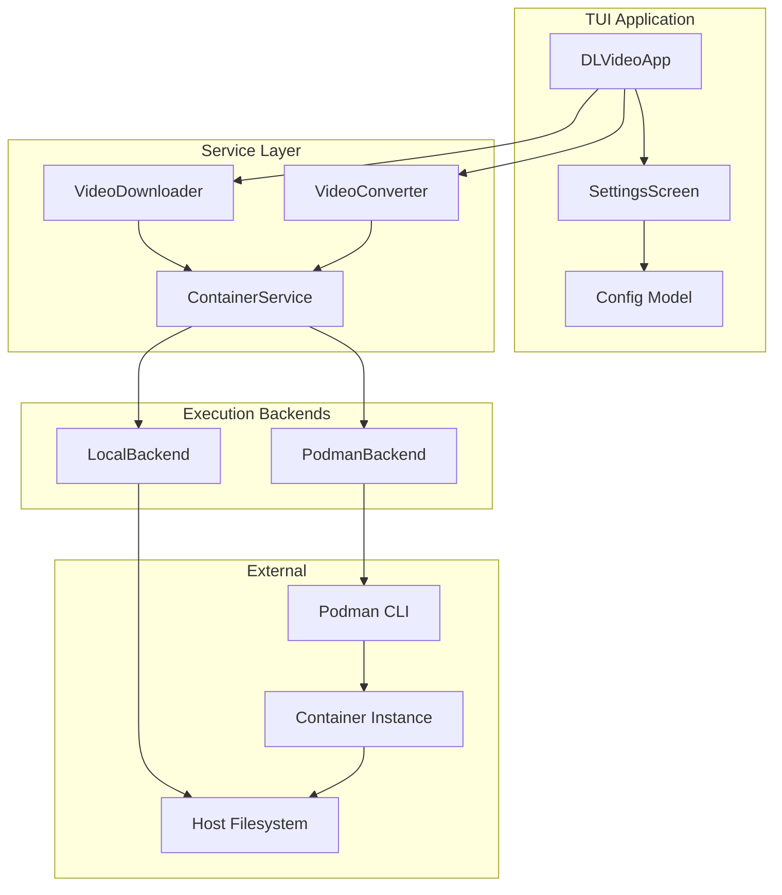

# Design Document: Podman Container Integration

## Overview

This design describes how the dl-video TUI application will integrate with Podman to execute video processing operations (yt-dlp downloads and ffmpeg conversions) inside containers. The architecture introduces a `ContainerService` abstraction that can execute commands either locally or via Podman, with the existing `VideoDownloader` and `VideoConverter` services delegating to this abstraction.

## Architecture



## Components and Interfaces

### ExecutionBackend Protocol

```python
from typing import Protocol, AsyncIterator, Callable
from pathlib import Path
from dataclasses import dataclass

@dataclass
class CommandResult:
    """Result of a command execution."""
    return_code: int
    stdout: str
    stderr: str

class ExecutionBackend(Protocol):
    """Protocol for command execution backends."""
    
    async def execute(
        self,
        command: list[str],
        working_dir: Path | None = None,
        env: dict[str, str] | None = None,
        volume_mounts: list[tuple[Path, Path]] | None = None,
        progress_callback: Callable[[str], None] | None = None,
    ) -> AsyncIterator[str]:
        """Execute a command and yield output lines.
        
        Args:
            command: Command and arguments to execute
            working_dir: Working directory for the command
            env: Environment variables to set
            volume_mounts: List of (host_path, container_path) tuples for container backend
            progress_callback: Callback for progress updates
            
        Yields:
            Output lines from the command
        """
        ...
    
    async def cancel(self) -> None:
        """Cancel the currently running command."""
        ...
    
    async def is_available(self) -> tuple[bool, str]:
        """Check if this backend is available.
        
        Returns:
            Tuple of (is_available, error_message_if_not)
        """
        ...
```

### LocalBackend

```python
class LocalBackend:
    """Execute commands directly on the host system."""
    
    def __init__(self) -> None:
        self._process: asyncio.subprocess.Process | None = None
        self._cancelled = False
    
    async def execute(
        self,
        command: list[str],
        working_dir: Path | None = None,
        env: dict[str, str] | None = None,
        volume_mounts: list[tuple[Path, Path]] | None = None,  # Ignored for local
        progress_callback: Callable[[str], None] | None = None,
    ) -> AsyncIterator[str]:
        """Execute command locally using asyncio subprocess."""
        ...
    
    async def cancel(self) -> None:
        """Terminate the running process."""
        ...
    
    async def is_available(self) -> tuple[bool, str]:
        """Always available on host."""
        return (True, "")
```

### PodmanBackend

```python
class PodmanBackend:
    """Execute commands inside Podman containers."""
    
    DEFAULT_IMAGE = "linuxserver/ffmpeg:latest"
    
    def __init__(self, image: str | None = None) -> None:
        self._image = image or self.DEFAULT_IMAGE
        self._container_id: str | None = None
        self._cancelled = False
    
    async def execute(
        self,
        command: list[str],
        working_dir: Path | None = None,
        env: dict[str, str] | None = None,
        volume_mounts: list[tuple[Path, Path]] | None = None,
        progress_callback: Callable[[str], None] | None = None,
    ) -> AsyncIterator[str]:
        """Execute command inside a Podman container.
        
        Creates a new container, runs the command, streams output,
        and removes the container when done.
        """
        ...
    
    async def cancel(self) -> None:
        """Stop and remove the running container."""
        ...
    
    async def is_available(self) -> tuple[bool, str]:
        """Check if Podman is installed and the image is available."""
        ...
    
    async def ensure_image(
        self,
        progress_callback: Callable[[str], None] | None = None
    ) -> bool:
        """Pull the container image if not present."""
        ...
```

### ContainerService

```python
from enum import Enum

class BackendType(Enum):
    LOCAL = "local"
    CONTAINER = "container"

class ContainerService:
    """Service for managing command execution across backends."""
    
    def __init__(
        self,
        backend_type: BackendType = BackendType.LOCAL,
        container_image: str | None = None,
    ) -> None:
        self._backend_type = backend_type
        self._container_image = container_image
        self._backend: ExecutionBackend | None = None
    
    def set_backend(self, backend_type: BackendType) -> None:
        """Switch the execution backend."""
        ...
    
    def get_backend(self) -> ExecutionBackend:
        """Get the current execution backend instance."""
        ...
    
    async def run_yt_dlp(
        self,
        args: list[str],
        output_dir: Path,
        progress_callback: Callable[[str], None] | None = None,
    ) -> AsyncIterator[str]:
        """Run yt-dlp with the current backend."""
        ...
    
    async def run_ffmpeg(
        self,
        args: list[str],
        input_path: Path,
        output_path: Path,
        progress_callback: Callable[[str], None] | None = None,
    ) -> AsyncIterator[str]:
        """Run ffmpeg with the current backend."""
        ...
    
    async def run_ffprobe(
        self,
        args: list[str],
        input_path: Path,
    ) -> CommandResult:
        """Run ffprobe and return the result."""
        ...
```

### Updated Config Model

```python
@dataclass
class Config:
    """Application configuration."""
    
    download_dir: Path
    auto_upload: bool
    skip_conversion: bool
    cookies_browser: str | None
    
    # New container settings
    execution_backend: str  # "local" or "container"
    container_image: str | None  # Custom image, defaults to linuxserver/ffmpeg
    
    @classmethod
    def default(cls) -> "Config":
        return cls(
            download_dir=Path.home() / "Downloads" / "yt_tmp",
            auto_upload=False,
            skip_conversion=False,
            cookies_browser=None,
            execution_backend="local",
            container_image=None,
        )
```

## Data Models

### BackendType Enum

```python
class BackendType(Enum):
    """Execution backend type."""
    LOCAL = "local"
    CONTAINER = "container"
```

### CommandResult Dataclass

```python
@dataclass
class CommandResult:
    """Result of a command execution."""
    return_code: int
    stdout: str
    stderr: str
    duration_seconds: float | None = None
```

### ContainerInfo Dataclass

```python
@dataclass
class ContainerInfo:
    """Information about a running container."""
    container_id: str
    image: str
    status: str
    created_at: str
```

## Podman Command Patterns

### Running yt-dlp in Container

```bash
podman run --rm \
    -v /host/download/dir:/downloads:Z \
    -v /host/cookies/dir:/cookies:ro,Z \
    --name dl-video-ytdlp-{job_id} \
    linuxserver/ffmpeg \
    yt-dlp --newline -o /downloads/%(title)s.%(ext)s {url}
```

### Running ffmpeg in Container

```bash
podman run --rm \
    -v /host/input/dir:/input:ro,Z \
    -v /host/output/dir:/output:Z \
    --name dl-video-ffmpeg-{job_id} \
    linuxserver/ffmpeg \
    ffmpeg -i /input/video.webm -progress pipe:1 /output/video.mp4
```

### Volume Mount Considerations

- Use `:Z` suffix for SELinux relabeling on systems with SELinux
- Mount input directories as read-only (`:ro`) when possible
- Use absolute paths for both host and container paths
- Create output directories before mounting if they don't exist


## Correctness Properties

*A property is a characteristic or behavior that should hold true across all valid executions of a system—essentially, a formal statement about what the system should do. Properties serve as the bridge between human-readable specifications and machine-verifiable correctness guarantees.*

### Property 1: Configuration Persistence Round-Trip

*For any* valid Config object with execution_backend and container_image values, serializing to JSON and deserializing should produce an equivalent Config object.

**Validates: Requirements 1.4**

### Property 2: Backend Routing Based on Configuration

*For any* ContainerService instance, when the backend_type is set to CONTAINER, calling get_backend() should return a PodmanBackend instance, and when set to LOCAL, should return a LocalBackend instance.

**Validates: Requirements 1.2, 1.3**

### Property 3: Custom Image Configuration

*For any* non-empty string provided as container_image to PodmanBackend, the generated Podman run command should include that exact image name.

**Validates: Requirements 2.2**

### Property 4: Volume Mount Construction

*For any* valid host path provided to run_yt_dlp or run_ffmpeg, the generated Podman command should include a volume mount argument mapping that host path to the appropriate container path.

**Validates: Requirements 3.2, 4.2**

### Property 5: Progress Line Streaming

*For any* sequence of output lines produced by a container command, the execute() async iterator should yield each line in the same order they were produced.

**Validates: Requirements 3.3, 4.3**

### Property 6: Cookies Configuration Passthrough

*For any* cookies_browser value configured, when running yt-dlp via container backend, the command should include the --cookies-from-browser argument with that value.

**Validates: Requirements 3.5**

### Property 7: Container Auto-Removal

*For any* command executed via PodmanBackend, the Podman run command should include the --rm flag to ensure automatic container cleanup.

**Validates: Requirements 5.1, 5.2**

### Property 8: Unique Container Naming

*For any* two concurrent operations with different job IDs, the generated container names should be different and include the respective job IDs.

**Validates: Requirements 5.4**

## Error Handling

### Podman Not Installed

When `podman --version` fails with FileNotFoundError:
- Return error: "Podman is not installed. Install it with: brew install podman (macOS) or see https://podman.io/getting-started/installation"

### Image Pull Failure

When `podman pull` fails:
- Capture stderr output
- Return error: "Failed to pull container image '{image}': {stderr}. Check your internet connection and image name."

### Container Start Failure

When `podman run` fails immediately:
- Capture container logs if available
- Return error: "Container failed to start: {error}. Logs: {logs}"

### Volume Mount Permission Error

When container reports permission denied on mounted volume:
- Detect "Permission denied" in stderr
- Return error: "Cannot access directory '{path}'. Check that the directory exists and has correct permissions. On SELinux systems, try: chcon -Rt svirt_sandbox_file_t {path}"

### Command Execution Timeout

When container command doesn't produce output for extended period:
- Implement configurable timeout (default: 30 minutes for downloads)
- On timeout, stop container and return error: "Operation timed out after {minutes} minutes"

## Makefile Integration

The Makefile will be extended with container-related targets:

```makefile
# Container-related targets
.PHONY: container-pull container-check container-test

# Pull the container image
container-pull:
	@echo "Pulling linuxserver/ffmpeg image..."
	@podman pull linuxserver/ffmpeg:latest

# Check if Podman and image are available
container-check:
	@echo "Checking Podman installation..."
	@podman --version || (echo "Podman not installed. Install with: brew install podman" && exit 1)
	@echo "Checking for linuxserver/ffmpeg image..."
	@podman image exists linuxserver/ffmpeg:latest || (echo "Image not found. Run: make container-pull" && exit 1)
	@echo "Container environment ready!"

# Test container execution
container-test:
	@echo "Testing yt-dlp in container..."
	@podman run --rm linuxserver/ffmpeg yt-dlp --version
	@echo "Testing ffmpeg in container..."
	@podman run --rm linuxserver/ffmpeg ffmpeg -version | head -1
	@echo "Container tests passed!"

# Run app with container backend (sets env var)
run-container:
	@DL_VIDEO_BACKEND=container $(UV) run python -m dl_video
```

The app will also check for `DL_VIDEO_BACKEND` environment variable to allow command-line override of the backend setting.

## Testing Strategy

### Unit Tests

Unit tests will verify:
- Config serialization/deserialization
- Backend selection logic
- Command argument construction
- Error message formatting
- Container name generation

### Property-Based Tests

Using Hypothesis for Python property-based testing:

1. **Config round-trip**: Generate random valid configs, serialize/deserialize, verify equality
2. **Backend routing**: Generate random backend types, verify correct backend class returned
3. **Volume mount construction**: Generate random valid paths, verify mount arguments
4. **Container naming**: Generate random job IDs, verify uniqueness and format

Configuration:
- Minimum 100 iterations per property test
- Each test tagged with: **Feature: podman-container-integration, Property {N}: {description}**

### Integration Tests

Integration tests (require Podman installed):
- Image pull when missing
- Simple command execution in container
- Volume mount read/write
- Container cleanup after success/failure
- Cancellation stops container

### Test File Structure

```
tests/
├── test_container_service.py      # Unit tests for ContainerService
├── test_backends.py               # Unit tests for LocalBackend, PodmanBackend
├── test_config_container.py       # Config persistence tests
├── test_container_properties.py   # Property-based tests
└── test_container_integration.py  # Integration tests (skipped if no Podman)
```
